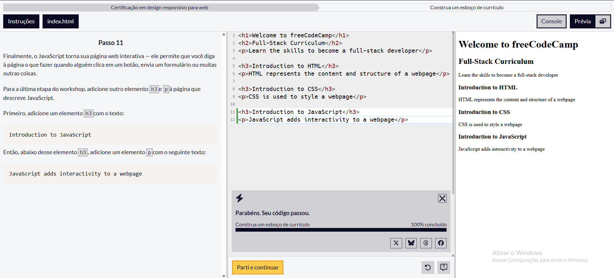
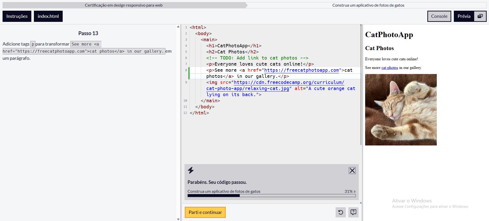
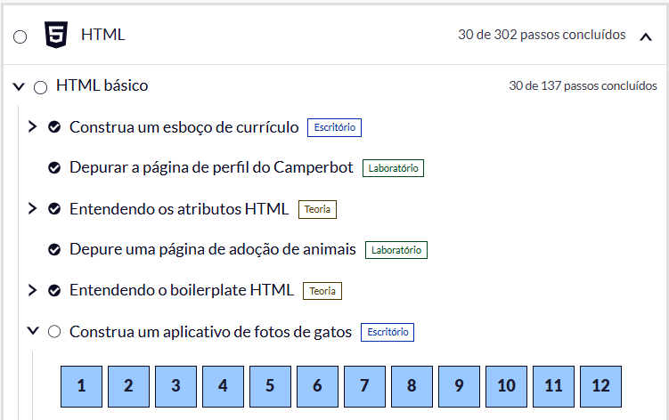

# Resolução de Desafios Práticos

**Estudante:**  Gustavo Nunes Borges  
**Plataforma Utilizada:** freeCodeCamp  
**Tecnologia Praticada:** HTML e CSS  
**Disciplina:** Design Profissional  

---

## Tabela de Exercícios e Comprovações

| Nº | Nome do Desafio / Lição | Breve Explicação | Status na Plataforma |
|---|---|---|---|
| 01 | Introdução ao HTML | Primeiro contato com a estrutura básica de uma página HTML. | Concluído |
| 02 | Elementos HTML | Utilização de elementos básicos para construção de páginas. | Concluído |
| 03 | Títulos e textos | Criação e organização de títulos e parágrafos. | Concluído |
| 04 | Elementos de texto | Utilização de diferentes elementos para formatar e organizar conteúdos. | Concluído |
| 05 | Links | Criação de links e navegação entre páginas. | Concluído |
| 06 | Imagens | Inserção de imagens utilizando HTML. | Concluído |
| 07 | Atributos HTML | Utilização de atributos para configurar os elementos. | Concluído |
| 08 | Listas | Criação de listas ordenadas e não ordenadas. | Concluído |
| 09 | Estrutura da página | Organização dos elementos dentro do documento HTML. | Concluído |
| 10 | Elementos semânticos | Utilização de elementos para melhorar a organização do conteúdo. | Concluído |
| 11 | Formulários | Introdução à criação de formulários HTML. | Concluído |
| 12 | Campos de formulário | Criação e configuração de campos para entrada de dados. | Concluído |
| 13 | Botões | Criação de botões e elementos de interação. | Concluído |
| 14 | Labels | Identificação dos campos presentes nos formulários. | Concluído |
| 15 | Inputs | Utilização de diferentes tipos de campos de entrada. | Concluído |
| 16 | Organização de conteúdo | Estruturação dos elementos de uma página. | Concluído |
| 17 | Introdução ao CSS | Primeiro contato com estilos utilizando CSS. | Concluído |
| 18 | Seletores CSS | Aplicação de estilos utilizando seletores. | Concluído |
| 19 | Cores | Aplicação de cores aos elementos da página. | Concluído |
| 20 | Tipografia | Alteração de fontes e estilos de textos. | Concluído |
| 21 | Tamanho dos elementos | Controle de largura, altura e tamanho dos componentes. | Concluído |
| 22 | Margens | Utilização de margens para organizar o espaço externo dos elementos. | Concluído |
| 23 | Padding | Utilização de espaçamento interno nos elementos. | Concluído |
| 24 | Bordas | Aplicação e configuração de bordas nos elementos. | Concluído |
| 25 | Classes CSS | Criação de classes para reutilização de estilos. | Concluído |
| 26 | IDs | Utilização de identificadores para elementos específicos. | Concluído |
| 27 | Box Model | Aplicação dos conceitos de conteúdo, padding, borda e margem. | Concluído |
| 28 | Layout | Organização dos elementos dentro da página utilizando CSS. | Concluído |
| 29 | Estilização de componentes | Combinação de propriedades CSS para criar uma interface organizada. | Concluído |
| 30 | Projeto prático | Aplicação dos conceitos de HTML e CSS aprendidos durante os exercícios. | Concluído |

---

## Imagens Comprobatórias

As imagens abaixo apresentam o progresso realizado na plataforma freeCodeCamp.

### Exercícios 01 a 10

### Exercícios 11 a 20

### Exercícios 21 a 30

---

## Resumo dos Conceitos Praticados

Durante os exercícios realizados no freeCodeCamp, foram praticados conceitos fundamentais de **HTML e CSS**, incluindo a criação e organização de páginas, utilização de elementos HTML, links, imagens, formulários, campos de entrada e botões.

Também foram trabalhados conceitos de CSS, como **seletores, cores, tipografia, margens, padding, bordas, classes, IDs e organização do layout**. Os exercícios ajudaram a compreender melhor como estruturar uma página web e aplicar estilos para melhorar sua apresentação visual.

### Principais dificuldades

As principais dificuldades encontradas foram compreender inicialmente a estrutura dos elementos HTML e entender como cada propriedade CSS influencia a aparência e o posicionamento dos elementos na página.

Com a realização dos exercícios, foi possível compreender melhor a relação entre HTML e CSS e como utilizar os dois em conjunto para desenvolver páginas web.

### Estruturas e recursos utilizados

- HTML
- CSS
- Tags HTML
- Imagens
- Links
- Cores
- Margem e padding
- Bordas
- Organização de layout
